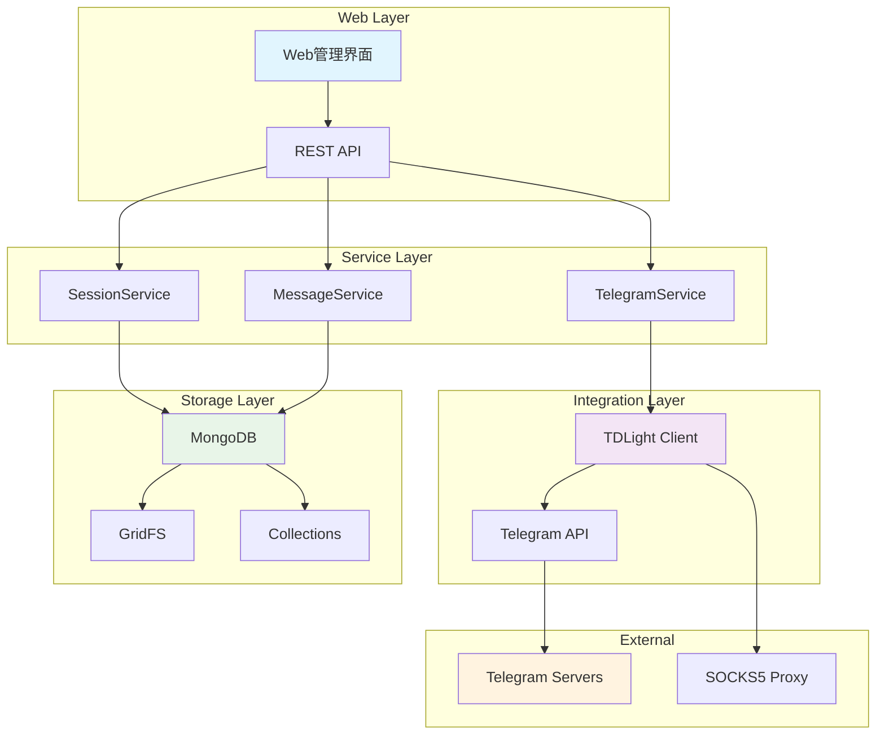
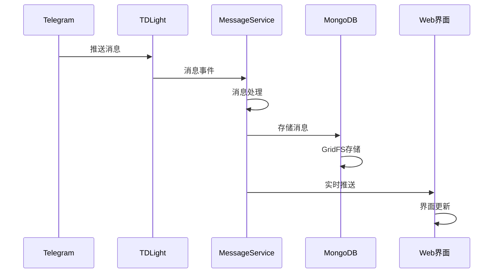
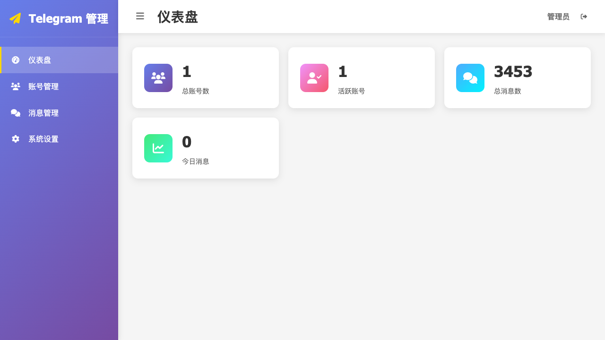
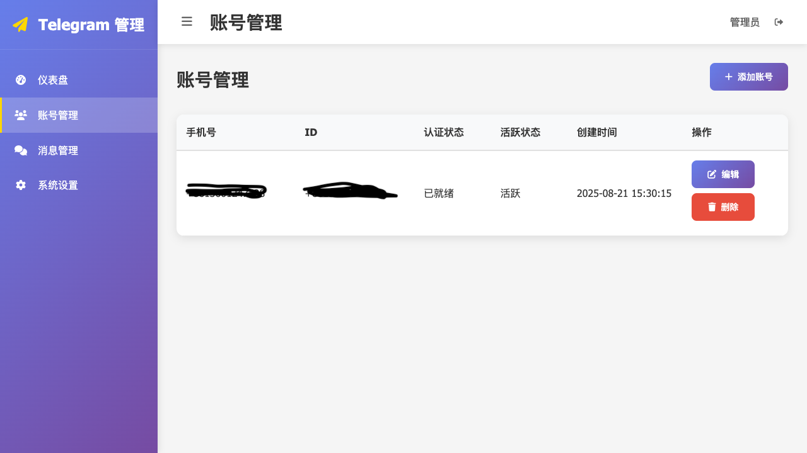
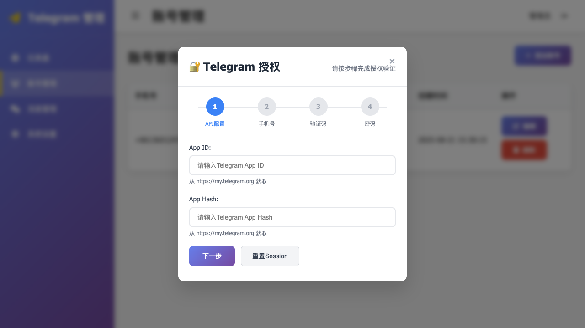
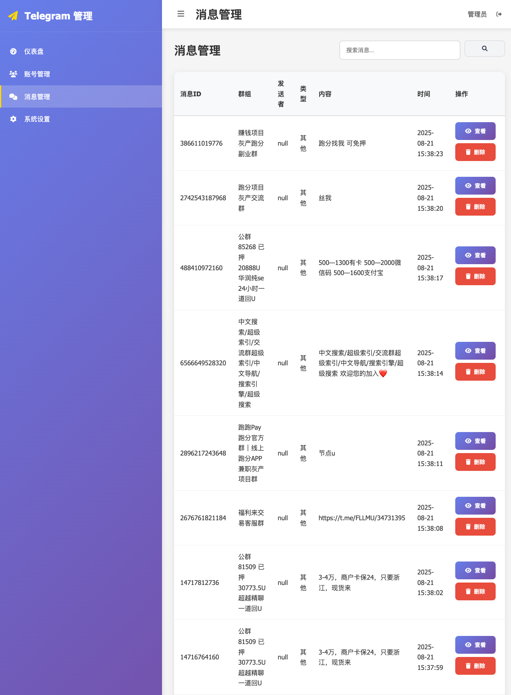
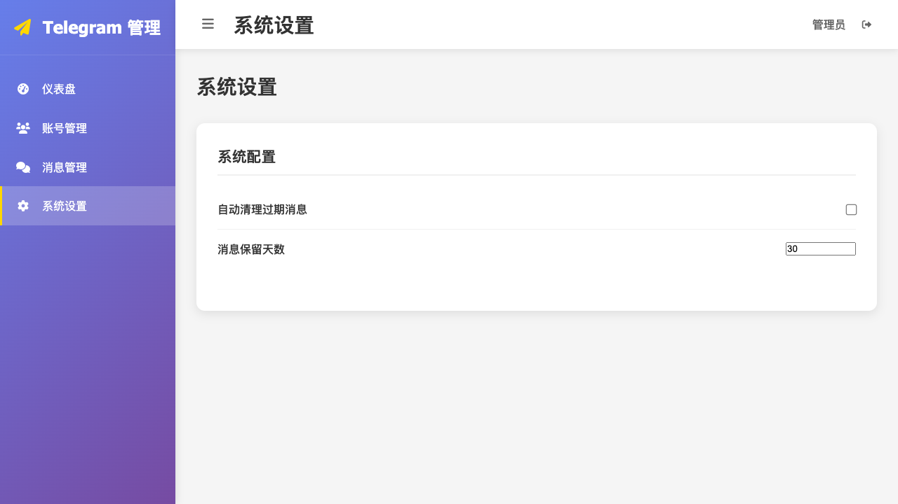

<div align="center">

# 🚀 Magic Telegram Server

**高性能 Telegram 消息监听服务 | Real-time Telegram Message Listener**

[](https://www.oracle.com/java/)
[](https://spring.io/projects/spring-boot)
[](https://github.com/tdlight-team/tdlight-java)
[](https://www.docker.com/)
[](LICENSE)
[](https://www.mongodb.com/)

*一个基于 Spring Boot 和 TDLight-Java 的企业级 Telegram 消息实时监听与管理平台*

[English](#english) | [中文文档](#chinese)

</div>

---

## 🌟 为什么选择 Magic Telegram Server？

- 🔥 **零配置启动** - Docker 一键部署，5分钟内完成搭建
- ⚡ **高性能架构** - 基于 Spring Boot 3.2 + TDLight 原生库
- 💾 **智能存储** - MongoDB GridFS + 自动压缩 + 完整性校验
- 🌐 **可视化管理** - 现代化 Web 管理界面，支持移动端
- 🔐 **企业级安全** - Session 持久化 + 数据加密 + 访问控制
- 🐳 **云原生支持** - 完整 Docker 生态 + 多平台部署


## ✨ 核心特性

### 🚀 开箱即用
- **一键部署** - Docker Compose 快速启动，支持内置/外部 MongoDB
- **零配置** - 智能默认配置，5分钟完成部署
- **跨平台** - 支持 macOS/Linux/Windows 多平台运行

### ⚡ 高性能架构
- **Spring Boot 3.2** - 最新企业级框架，原生支持 GraalVM
- **TDLight 原生库** - 基于 Telegram 官方 TDLib，性能卓越
- **异步处理** - 非阻塞消息处理，支持高并发
- **智能重试** - 自动故障恢复，确保服务稳定性

### 💾 智能存储系统
- **GridFS 存储** - MongoDB GridFS 大文件存储，突破 16MB 限制
- **自动压缩** - GZIP 压缩算法，节省 60%+ 存储空间
- **完整性校验** - SHA256 哈希验证，确保数据安全
- **分层存储** - 根据数据大小自动选择最优存储策略

### 🌐 现代化管理界面
- **响应式设计** - 支持桌面端/移动端访问
- **实时监控** - 消息状态、系统性能实时展示
- **可视化操作** - 账户管理、认证流程可视化
- **安全认证** - 内置权限控制，保护管理功能

### 🔐 企业级安全
- **Session 持久化** - 自动会话管理，支持服务重启
- **代理支持** - SOCKS5 代理，保护网络安全
- **数据加密** - 敏感信息加密存储
- **访问控制** - 细粒度权限管理

## 系统要求

### 🐳 Docker部署
- Docker 20.0+
- Docker Compose 2.0+ (可选)
- macOS/Linux/Windows
- 网络代理（用于访问Telegram服务器）

### 🔧 本地开发部署
- Java 17+
- Maven 3.6+
- MongoDB 4.0+ (用于GridFS存储)
- macOS/Linux/Windows
- 网络代理（用于访问Telegram服务器）

## 配置说明


### 代理配置
- 类型: SOCKS5
- 地址: 127.0.0.1
- 端口: 7890

### Session存储配置
- 存储策略: GridFS (MongoDB)
- 压缩算法: GZIP
- 分片阈值: 8MB
- 完整性校验: SHA256

## 🚀 快速开始

### 📦 一键部署（推荐）

```bash
# 克隆项目
git clone https://github.com/your-username/magic-telegram-server.git
cd magic-telegram-server/docker

# 一键启动（包含 MongoDB）
docker compose up -d

# 🎉 完成！访问管理界面
open http://localhost:8080/api/admin/index.html
```

### 🎯 使用场景

<details>
<summary>📊 <strong>群组消息监控</strong></summary>

- 实时监听多个 Telegram 群组消息
- 自动存储和分析消息内容
- 支持关键词过滤和告警
- 数据可视化展示

</details>

<details>
<summary>🤖 <strong>机器人开发</strong></summary>

- 作为 Telegram Bot 的消息处理后端
- 提供 RESTful API 接口
- 支持消息转发和自动回复
- 集成第三方服务

</details>

<details>
<summary>📈 <strong>数据分析</strong></summary>

- 收集 Telegram 群组数据
- 用户行为分析
- 消息趋势统计
- 导出数据报告

</details>

### 🔧 开发环境部署

```bash
# 环境要求
# Java 17+, Maven 3.6+, MongoDB 4.0+

# 启动应用
mvn spring-boot:run

# 访问管理界面
open http://localhost:8080/api/admin/index.html
```

### ⚡ 5分钟快速配置

1. **启动服务** - `docker compose up -d`
2. **打开管理界面** - 访问 `http://localhost:8080/api/admin/index.html`
3. **创建账户** - 点击"添加账户"按钮
4. **配置 API** - 输入 Telegram API ID 和 Hash
5. **手机验证** - 输入手机号接收验证码
6. **开始监听** - 启动消息监听服务

> 💡 **提示**: 无需修改配置文件，所有设置通过 Web 界面完成！


## 🏗️ 技术架构

### 📚 技术栈

| 组件 | 技术选型 | 版本 | 说明 |
|------|---------|------|------|
| **后端框架** | Spring Boot | 3.2.0 | 企业级微服务框架 |
| **Telegram SDK** | TDLight-Java | 3.4.0 | 官方 TDLib Java 绑定 |
| **数据库** | MongoDB | 4.0+ | 文档数据库 + GridFS |
| **容器化** | Docker | 20.0+ | 容器化部署 |
| **构建工具** | Maven | 3.6+ | 依赖管理和构建 |
| **JVM** | OpenJDK | 17+ | 长期支持版本 |

### 🎯 架构设计



### 🔄 消息处理流程



---

### 管理系统功能

#### 1. 仪表盘
管理系统主页提供了系统状态概览和快速操作入口。



#### 2. 账号管理
提供完整的Telegram账号管理功能：
- 账号创建和删除
- API配置管理
- 认证状态查看
- Session管理



**添加账号功能**：
支持通过弹窗形式添加新的Telegram账号，包括API配置和认证流程。



#### 3. 消息管理
实时查看和管理Telegram消息：
- 消息历史记录
- 消息搜索和过滤
- 消息状态监控



#### 4. 系统设置
系统配置和参数管理：
- 代理设置
- 存储配置
- 日志级别设置
- 系统监控



### 管理系统特性

- 🎨 **现代化UI设计** - 基于Bootstrap的响应式界面
- 🔐 **安全认证** - 内置认证机制，保护管理功能
- 📱 **移动端适配** - 支持手机和平板设备访问
- ⚡ **实时更新** - 状态信息实时刷新
- 🛠️ **操作便捷** - 一键式操作，简化管理流程

### 访问方式

启动应用后，通过以下URL访问管理系统：
```
http://localhost:8080/api/admin/index.html
```


## 项目结构

```
magic-telegram-server/
├── .dockerignore                                   # Docker忽略文件
├── .env                                            # 环境变量配置
├── .env.example                                    # 环境变量示例
├── .env.external.example                           # 外部环境变量示例
├── .github/                                        # GitHub Actions配置
│   └── workflows/
│       └── docker-build.yml                       # Docker自动构建流程
├── docker/                                         # Docker相关文件
│   ├── .dockerignore                               # Docker忽略文件
│   ├── Dockerfile                                  # 主Dockerfile
│   ├── Dockerfile.simple                           # 简化版Dockerfile
│   ├── docker-compose.yml                         # Docker Compose配置
│   ├── docker-compose.external.yml                # 外部Docker Compose配置
│   ├── app/                                        # 应用配置
│   │   └── config/                                 # 配置文件目录
│   └── mongodb/                                    # MongoDB配置
│       └── init/                                   # MongoDB初始化脚本
├── docs/                                           # 文档目录
│   └── images/                                     # 文档图片
├── src/
│   ├── main/
│   │   ├── java/com/telegram/server/
│   │   │   ├── MagicTelegramServerApplication.java  # 主入口
│   │   │   ├── config/                             # 配置类
│   │   │   │   ├── AsyncConfig.java                # 异步配置
│   │   │   │   ├── GridFSConfig.java               # GridFS配置
│   │   │   │   ├── MessageStorageConfig.java       # 消息存储配置
│   │   │   │   ├── TelegramConfig.java             # Telegram配置
│   │   │   │   ├── TelegramConfigManager.java      # Telegram配置管理器
│   │   │   │   └── WebMvcConfig.java               # Web MVC配置
│   │   │   ├── controller/                         # 控制器层
│   │   │   │   ├── TelegramController.java         # Telegram REST控制器
│   │   │   │   ├── WebAdminController.java         # Web管理控制器
│   │   │   │   ├── MessageStorageTestController.java # 消息存储测试控制器
│   │   │   │   └── admin/                          # 管理后台控制器
│   │   │   ├── dto/                                # 数据传输对象
│   │   │   │   ├── AccountDTO.java                 # 账户DTO
│   │   │   │   ├── MessageDTO.java                 # 消息DTO
│   │   │   │   ├── PageRequestDTO.java             # 分页请求DTO
│   │   │   │   ├── PageResponseDTO.java            # 分页响应DTO
│   │   │   │   └── SystemStatsDTO.java             # 系统统计DTO
│   │   │   ├── entity/                             # 实体类
│   │   │   │   ├── TelegramMessage.java            # Telegram消息实体
│   │   │   │   └── TelegramSession.java            # Telegram会话实体
│   │   │   ├── lifecycle/                          # 生命周期管理
│   │   │   │   └── ApplicationLifecycleManager.java # 应用生命周期管理器
│   │   │   ├── monitor/                            # 监控组件
│   │   │   │   └── MessageStorageMonitor.java      # 消息存储监控器
│   │   │   ├── repository/                         # 数据访问层
│   │   │   │   ├── TelegramMessageRepository.java  # 消息仓库
│   │   │   │   └── TelegramSessionRepository.java  # 会话仓库
│   │   │   ├── service/                            # 服务层
│   │   │   │   ├── ITelegramService.java           # Telegram服务接口
│   │   │   │   ├── ITelegramSessionService.java    # 会话服务接口
│   │   │   │   ├── ITelegramMessageService.java    # 消息服务接口
│   │   │   │   ├── gridfs/                         # GridFS服务
│   │   │   │   │   ├── GridFSService.java          # GridFS核心服务
│   │   │   │   │   ├── GridFSStorageManager.java   # GridFS存储管理器
│   │   │   │   │   ├── GridFSCompressionService.java # GridFS压缩服务
│   │   │   │   │   ├── GridFSIntegrityService.java # GridFS完整性服务
│   │   │   │   │   └── GridFSIntegrityChecker.java # GridFS完整性检查器
│   │   │   │   └── impl/                           # 服务实现
│   │   │   │       ├── TelegramServiceImpl.java   # Telegram服务实现
│   │   │   │       ├── TelegramSessionServiceImpl.java # 会话服务实现
│   │   │   │       └── TelegramMessageServiceImpl.java # 消息服务实现
│   │   │   ├── storage/                            # 存储相关
│   │   │   │   ├── exception/                      # 存储异常
│   │   │   │   ├── monitor/                        # 存储监控
│   │   │   │   ├── strategy/                       # 存储策略
│   │   │   │   └── util/                           # 存储工具
│   │   │   └── util/                               # 工具类
│   │   │       ├── ImageProcessingUtil.java       # 图片处理工具
│   │   │       ├── PathValidator.java             # 路径验证工具
│   │   │       ├── RetryHandler.java              # 重试处理器
│   │   │       └── TimeZoneUtil.java              # 时区工具
│   │   └── resources/                              # 资源文件
│   │       ├── application.yml                     # 主配置文件
│   │       └── static/                             # 静态资源
│   │           └── admin/                          # 管理后台前端
│   │               ├── index.html                 # 管理后台主页
│   │               ├── css/                       # 样式文件
│   │               │   ├── admin.css              # 管理后台样式
│   │               │   └── auth-modal.css         # 认证弹窗样式
│   │               └── js/                        # JavaScript文件
│   │                   ├── admin.js               # 管理后台主脚本
│   │                   ├── api.js                 # API调用脚本
│   │                   ├── components.js          # 组件脚本
│   │                   ├── utils.js               # 工具脚本
│   │                   └── components/            # 组件目录
│   │                       └── auth-modal.js      # 认证弹窗组件
│   └── test/                                       # 测试代码
│       ├── java/                                   # Java测试
│       └── resources/                              # 测试资源
│           └── application-test.yml                # 测试配置
├── pom.xml                                         # Maven配置
├── settings.xml                                    # Maven设置
├── LICENSE                                         # 许可证文件
└── readme.md                                       # 项目说明
```

## 功能闭环说明

本项目实现了完整的单账户Telegram消息监听功能闭环：

### 1. 单账户创建
- 通过 `/telegram/account/create` 接口初始化账户
- 重置所有运行时配置，准备新的认证流程
- 支持重复创建，自动清理旧的客户端连接

### 2. Session流程
- **API配置**: 设置Telegram API ID和Hash
- **手机号认证**: 提交手机号码，接收验证码
- **验证码验证**: 提交短信验证码进行验证
- **密码验证**: 如开启两步验证，需提交密码
- **Session持久化**: 认证成功后自动保存会话信息
- **智能存储**: 根据数据大小自动选择GridFS或传统存储方式
- **数据压缩**: 大于8MB的数据自动进行GZIP压缩
- **完整性校验**: 使用SHA256哈希确保数据完整性

### 3. 消息监听
- 认证完成后可启动实时消息监听
- 支持群组消息的实时接收和处理
- 消息内容实时输出到控制台日志
- 支持启动/停止监听控制

## 注意事项

1. **代理设置**: 确保SOCKS5代理服务正常运行在127.0.0.1:7890
2. **MongoDB服务**: 确保MongoDB 4.0+服务正常运行，用于GridFS存储
3. **会话持久化**: 认证成功后会在MongoDB中保存会话信息，支持GridFS大文件存储
4. **存储策略**: 系统自动根据数据大小选择存储方式，大于8MB使用GridFS
5. **数据压缩**: 大文件自动进行GZIP压缩，节省存储空间
6. **群组权限**: 确保Telegram账号已加入需要监听的群组
7. **网络连接**: 需要稳定的网络连接和代理服务
8. **单账户模式**: 系统只支持单个账户，创建新账户会清理旧账户数据

## 故障排除

### 连接问题
- 检查代理服务是否正常运行
- 确认代理端口配置正确
- 验证网络连接状态

### 认证问题
- 确认API ID和Hash正确
- 检查手机号格式（需包含国家代码）
- 验证验证码输入是否正确
- 如有两步验证，确保密码正确

### Session问题
- 如认证失败，可使用 `/telegram/session/clear` 清理Session数据
- 清理后需重新进行完整认证流程
- Session数据存储在MongoDB中，支持GridFS大文件存储
- 检查MongoDB连接状态和GridFS配置

### 存储问题
- 确认MongoDB服务正常运行
- 检查GridFS存储空间是否充足
- 验证数据压缩和完整性校验功能
- 查看存储策略配置是否正确

### 依赖问题
- 清理Maven缓存: `mvn clean`
- 重新下载依赖: `mvn dependency:resolve`
- 检查TDLight依赖是否正确下载
- 确认Java版本为17+


## 🤝 贡献指南

我们欢迎所有形式的贡献！无论是 Bug 报告、功能建议还是代码贡献。

### 🐛 报告问题

- 使用 [GitHub Issues](https://github.com/your-username/magic-telegram-server/issues) 报告 Bug
- 提供详细的错误信息和复现步骤
- 包含系统环境信息（OS、Java版本等）

### 💡 功能建议

- 在 Issues 中使用 `enhancement` 标签
- 详细描述功能需求和使用场景
- 欢迎提供设计方案和实现思路

### 🔧 代码贡献

1. Fork 项目到你的 GitHub
2. 创建功能分支: `git checkout -b feature/amazing-feature`
3. 提交更改: `git commit -m 'Add amazing feature'`
4. 推送分支: `git push origin feature/amazing-feature`
5. 创建 Pull Request

### 📋 开发规范

- 遵循 Java 代码规范
- 添加必要的单元测试
- 更新相关文档
- 提交信息使用英文，格式清晰

## 🌟 Star History

[](https://api.star-history.com/svg?repos=liubowyf/magic-telegram-server&type=Date)

## 📞 社区支持


- 📧 **邮件**: [liubowyf@163.com](mailto:liubowyf@163.com)
- 🐛 **问题**: [GitHub Issues](https://github.com/liubowyf/magic-telegram-server/issues)
- 📖 **文档**: [项目 Wiki](https://github.com/liubowyf/magic-telegram-server/wiki)

## 📈 版本历史

<details>
<summary>查看版本历史</summary>

### v1.2.3 (2025-08-26)
- 🐳 **Docker优化**: 支持docker启动，支持打包启动和依赖外部mongodb两种方式

### v1.2.1 (2025-08-15)
- 🔧 **多平台支持优化**: 修复了仅支持macOS的问题
- 🐧 **Linux支持**: 添加了Linux x86_64 (GNU GCC + OpenSSL 1.x)原生库支持
- 🪟 **Windows支持**: 添加了Windows x86_64原生库支持
- 📦 **TDLight原生库**: 完善了跨平台TDLight原生库依赖配置

### v1.1.0 (2025-08-05)
- 💾 **GridFS智能存储**: 基于MongoDB GridFS的高效Session存储方案
- 🗜️ **数据压缩优化**: 自动GZIP压缩，节省存储空间
- 🔒 **数据完整性校验**: SHA256哈希校验确保数据安全
- ⚡ **智能存储策略**: 根据数据大小自动选择最优存储方式

</details>

## 作者

- **作者**: liubo
- **日期**: 2025-08-15
- **版本**: 1.2.3 (多平台支持版)

## 📄 许可证

本项目基于 [Apache License 2.0](LICENSE) 开源协议发布。

---

---

<div align="center">

# 🌍 English Documentation

</div>

**Magic Telegram Server** is an enterprise-grade Telegram message monitoring and management platform built with Spring Boot and TDLight-Java.

## 🚀 Key Features

- **🎯 One-Click Deployment** - Docker Compose ready, 5-minute setup
- **⚡ High Performance** - Built on Spring Boot 3.2 + TDLight native libraries  
- **💾 Smart Storage** - MongoDB GridFS + Auto compression + Integrity verification
- **🎨 Modern UI** - Responsive web management interface
- **🔒 Enterprise Security** - Session persistence + Data encryption + Access control
- **☁️ Cloud Native** - Complete Docker ecosystem + Multi-platform deployment

## 📦 Quick Start

```bash
# Clone and start
git clone https://github.com/your-username/magic-telegram-server.git
cd magic-telegram-server/docker
docker compose up -d

# Access web interface
open http://localhost:8080/api/admin/index.html
```

## 🎯 Use Cases

| Scenario | Description |
|----------|-------------|
| **📱 Message Monitoring** | Real-time Telegram group message listening |
| **🤖 Bot Development** | Backend service for Telegram bots |
| **📊 Data Analytics** | Collect and analyze Telegram data |
| **🏢 Enterprise Integration** | Integrate with existing systems |

## 🛠️ Tech Stack

| Component | Technology |
|-----------|------------|
| **Backend** | Spring Boot 3.2, TDLight-Java 3.4 |
| **Database** | MongoDB 4.0+ with GridFS |
| **Container** | Docker & Docker Compose |
| **Build** | Maven 3.6+, Java 17+ |

---

<div align="center">

## 🏷️ Keywords

`telegram` • `spring-boot` • `tdlight` • `mongodb` • `gridfs` • `docker`  
`message-listener` • `telegram-api` • `java` • `enterprise` • `real-time`  
`monitoring` • `bot` • `automation` • `microservice` • `cloud-native`

---

### ⭐ Star Us!

**🇨🇳 如果这个项目对你有帮助，请给我们一个 Star！**

**🇺🇸 If this project helps you, please give us a Star!**

</div>